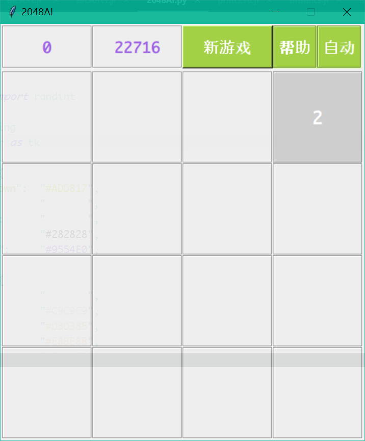
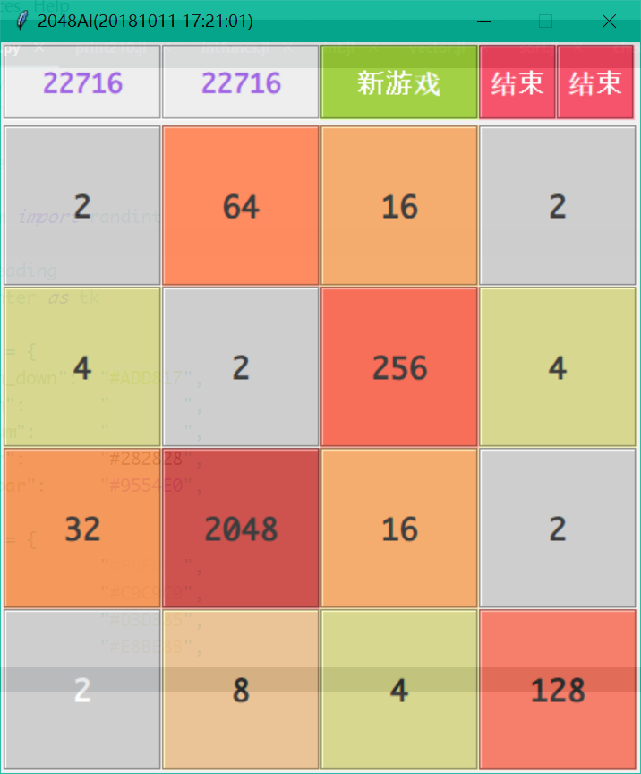

# Py2048AI

## 简介
学习Python免不了要用它做各种尝试，这是一个用Python写了一个能够自动运行的2048小游戏，代码全部使用类来实现，具有模块化，易扩展等特点。
目前还未添加AI算法，只是简单地模拟运行，取最高分的方向为该次游戏实际滑动的方向，平均能够玩到六七千分(没有仔细测量过)，有很大的概率能够玩到1024，达到2048的概率很小。
目前的设定是：如果你开启自动运行，它会一直运行下去直到某一次游戏结束时里面的数字含有2048。

## 使用方法：
* F1：新游戏按钮，按下之后开始新游戏
* F3：帮助按钮，按下之后格子会自动变换一次
* F5：自动运行控制按钮（如果正在自动运行，按下将停止，否则自动运行）

* 方向控制：方向键、W-A-S-D皆可使用。
* 菜单：如菜单所描述。
* 另外，电脑上面安装有Monaco字体会使得界面显示效果更好。

* 开始游戏

* 获得2048：

